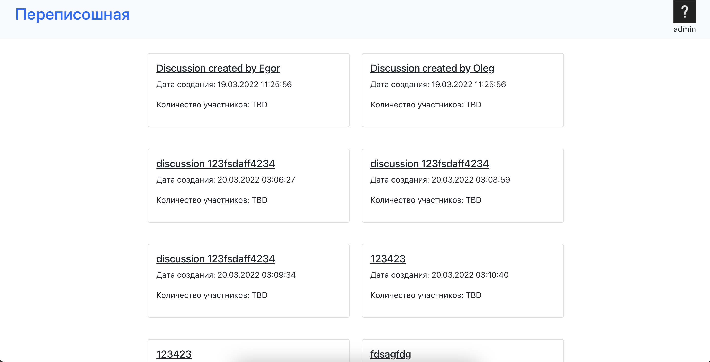

# Проект "Переписошная"

## Описание

Ни для кого не секрет, что чиновники отвечают на запросы граждан на "своем" языке, который в большинстве своем
непонятен простому пользователю. Таким образом данный проект предназначен для публикации "человекопонятной" 
переписки с чиновниками и различными госслужащими. 

Создать запрос (переписку) к госорганам может создать любой желающий. Человек может написать любой комментарий и 
при желании добавить нового участника в беседу (госслужащего или обычного гражданина). По окончании переписки
публикуется результат запроса.

## Backend (Python + Aiohttp)
#### Installing dependencies using Poetry:
Install [Poetry](https://python-poetry.org) (if poetry is not installed yet)
    
    poetry shell
    poetry install

#### To run server:
    
    poetry run python runserver.py

By default, backend runs on **127.0.0.1:8080**

## Frontend (React)
#### Installing dependencies:
Make sure you have [Node.js](https://nodejs.org/en/download/) pre-installed    

    npm install

#### Run front:
    
    npm start

If you see no errors in the console, try to isit [127.0.0.1:3000](http://127.0.0.1:3000) 
and test the application!
